# Fixing the installation issue of the Windows 10 January 2024 Security Update (KB5034441)

If you experience a Download error (0x80070643) installing the January 2024 Security Update (KB5034441) on your Windows system, this guide can help you.

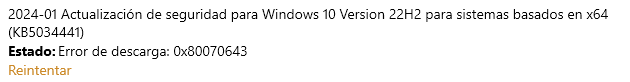

## Requirements

You will need a Windows Recovery Partition that is 600 MB or more in size. To check the size of your recovery partition, check out Disk Manager:

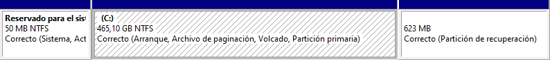

If it is not big enough, try following [this guide](https://support.microsoft.com/en-us/topic/kb5034441-windows-recovery-environment-update-for-windows-10-version-21h2-and-22h2-january-9-2024-62c04204-aaa5-4fee-a02a-2fdea17075a8) to expand your partition.

## Manually applying the update

If, despite having a recovery partition big enough for the update, you still encounter the same error, you can fix it by **manually applying the update package**. Here is how you can do it.

### Understanding the installation procedure

Installing the KB5034441 update launches a new process: the Windows Recovery Environment Update Installer (`WinREUpdateInstaller.exe`), stored in the `%windir%\TEMP` directory. It does not require passing any arguments, so its execution is simple. You can view this information easily with Task Manager:

When the update fails, this directory is deleted. However, we can perform file operations in this folder when the update is being installed. Knowing this, we can **copy the files in the startup directory** to another folder, which will not be deleted.

### Copying update installer files

While you can use the File Explorer to copy the files from that folder, you can use the Command Prompt to achieve this more quickly.

To do so, launch Command Prompt **as an administrator** (press <kbd>⊞ Win</kbd> + <kbd>R</kbd>, type `cmd`, press <kbd>Ctrl</kbd> + <kbd>Shift</kbd> + <kbd>Enter</kbd>, and accept any UAC prompts in your way), then type `cd <update-path>` (where `<update-path>` is the startup path of the WinRE Update Installer), and type `xcopy * \winre-update /cehyi` (replace `winre-update` with your preferred directory).

Now you have a copy of those files!

### The update manifest

If we dig deeper into the update installer files, we will see the following:

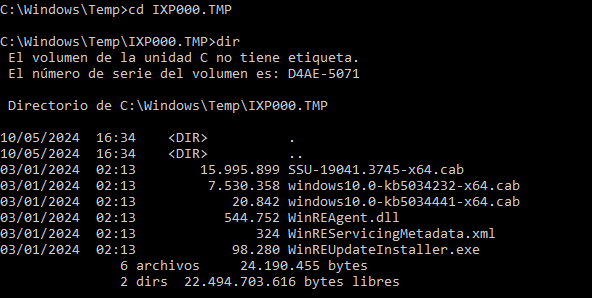

3 CAB files, the Windows Recovery Environment Agent DLL (`WinREAgent.dll`), the Update Installer, and the servicing metadata.

The last file mentioned is the important one, as it is used by the Update Installer to determine what update to apply, and where to apply it.

These are the contents of this file:

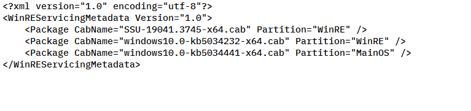

Let's break down the XML elements:

- `CabName` is the property that determines what package to apply. Here we can see 3 files being added: a Servicing Stack Update (SSU) and 2 other update packages
- `Partition` is the property that determines where to apply the package. There are 2 possible values: `WinRE` and `MainOS`:
    - If this property is `WinRE`, the Update Installer will apply a package to the recovery partition
    - If this property is `MainOS`, the Update Installer will apply a package to your active installation

With this in mind, we can start adding the update packages. For this, enter the [**Deployment Image Servicing and Management (DISM) tool**](https://learn.microsoft.com/en-us/windows-hardware/manufacture/desktop/what-is-dism?view=windows-11).

### DISM is not just for repairing corrupted Windows installations

DISM works with the concept of Windows Imaging (WIM) files, which are files that contain full installations of Windows that are compressed to make images small in size.

You may have heard of this utility when you needed to recover a corrupted Windows installation. [Almost every DISM article on the Internet](https://duckduckgo.com/?t=ffab&q=dism&ia=web) explains this. However, this tool can be used for so much more.

With that out of the way, let's start **servicing the Windows RE image**. The Windows Recovery Environment image is stored in the recovery partition, which is hidden by default. Therefore, we need to make it visible.

To do this, you will need to use the `DiskPart` utility and do the following:

1. Select the disk containing your recovery partition by typing `select disk <disk #>` (where `<disk #>` is the index number of your disk)
2. List all partitions in the selected disk (`list partition`) and select the partition number whose type is Recovery (`select partition <part #>`, where `<part #>` is the index number of the partition)
3. Assign it any letter you want by typing `assign letter <letter>`
4. Exit DiskPart (`exit`)

For example:

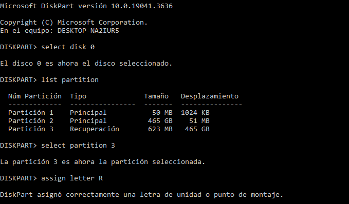

> [!NOTE]
> This guide will use R as the recovery partition. Be sure to replace it with your assigned letter

If you have done everything correctly, you will now see a new drive in This PC. This is the recovery partition. When you access it, you may notice that it does not contain anything.

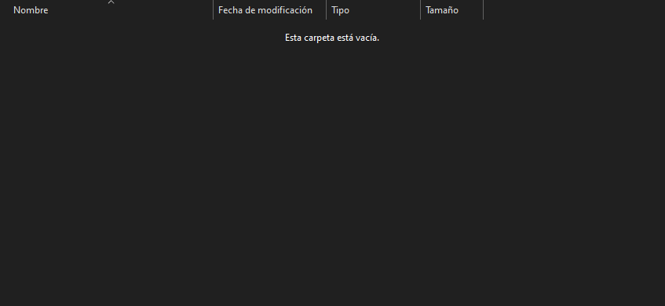

However, everything in this drive is hidden, so we will need to continue using the Command Prompt. To switch to the drive, type `R:`. Then perform a directory listing with `dir /ah` (this shows files that are hidden).

You will notice a directory called `Recovery`. You cannot access this folder (`cd Recovery`) as a regular user, so you need to start it as an administrator. After getting files once again, you will find a `WindowsRE` directory. Go to it (`cd WindowsRE`), and perform another directory listing. This is the full result:

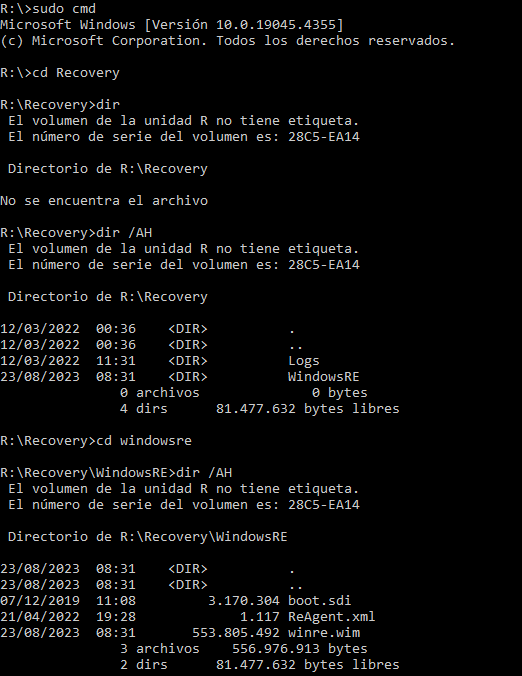

You will then see a WIM file called `WinRE.wim`. This is when DISM comes into play. First, we will get information about this image to see what we are dealing with. To do this, type `dism /get-imageinfo /imagefile=winre.wim`:

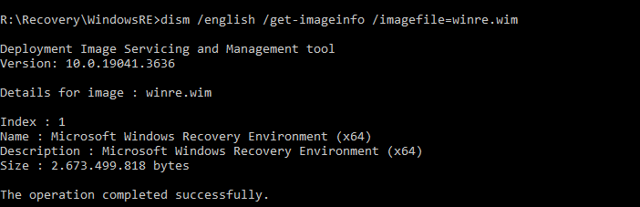

Since we only have 1 index in it, we can easily proceed by typing `dism /mount-image /imagefile=winre.wim /index=1 /mountdir=C:\WinRE` (replace `C:\WinRE` with your desired folder, and make sure it exists)

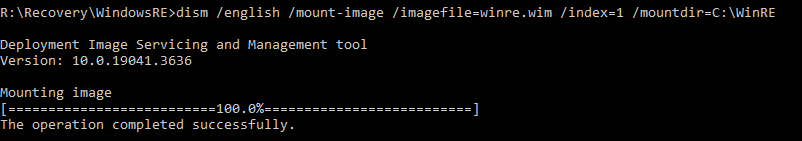

Once it successfully completes, you can go back to your boot drive (type `C:`).

Now let's apply the packages.

### Adding the Windows packages

> [!NOTE]
> All package addition operations will be performed with a GUI, but command line instructions will still be offered

Here is the complete image information of my WIM file:

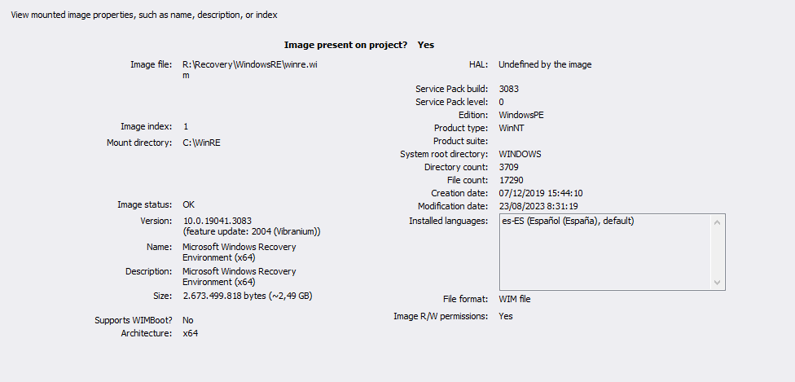

To add packages to the Windows image, we run the following command:

`dism /image=<image path> /add-package /packagepath="<package path>"`

Here it is important to select the appropriate update packages for the image. For the Windows RE image, add the following:

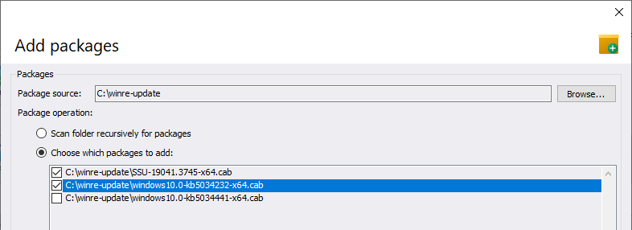

You can add these manually by typing:

- `dism /image="<image path>" /add-package /packagepath="<package source>\SSU-19041.3745-<architecture>.cab"`
- `dism /image="<image path>" /add-package /packagepath="<package source>\windows10.0-kb5034232-<architecture>.cab"`

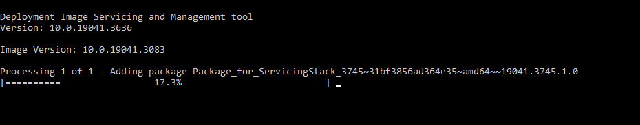
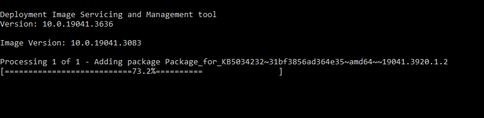

> [!NOTE]
> Replace `<image path>` with your mount directory, `<package source>` with the location of the packages, and `<architecture>` with your system architecture

These packages should be added successfully:

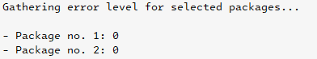

After they have been added, save changes to the image and unmount it by running `dism /unmount-image /mountdir="<image path>" /commit`

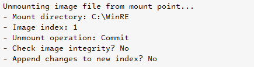

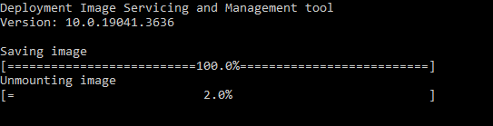

Once it is unmounted successfully (you should see `The operation completed successfully`), switch to your active installation to add the third package:

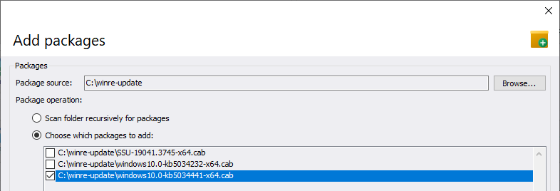

Here is the information of this package if you are interested:

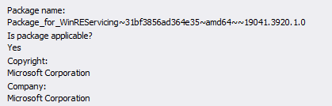
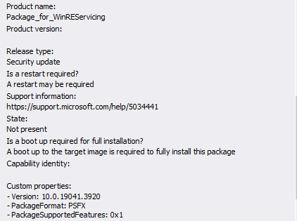

To do this, type `dism /online /add-package /packagepath="<package source>\windows10.0-kb5034441-<architecture>.cab"`

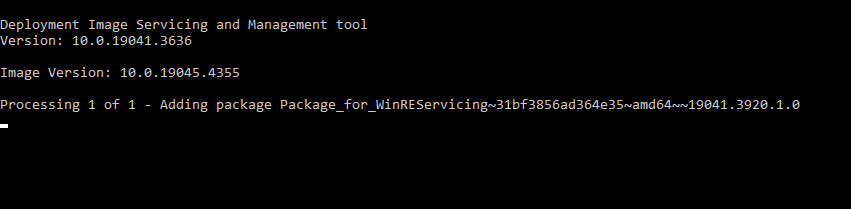

Once it is added successfully, you can get package information to verify that it is present:

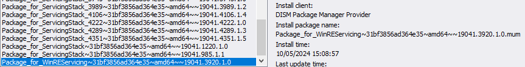

Finally, after adding all packages, verify that you have enough space on the Windows RE partition for any future changes you would like to make:

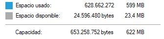

In this case, around 23 MB are still available, which should be plenty.

### Hiding the recovery partition

After that has been done, we will need to hide the recovery partition with DiskPart. This is how you can do it:

1. List all volumes with `list volume`
2. Select the volume with the letter you had previously assigned (`select volume <volume #>`, where `<volume #>` is the index number of the volume)
3. Remove its letter by typing `remove`
4. Exit DiskPart (`exit`)

For example:

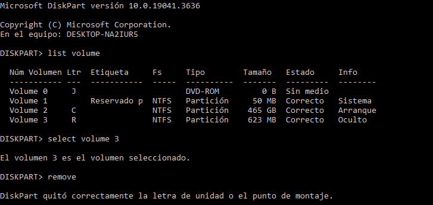

### Initiating the update

Once you have successfully done everything, go back to Windows Update and click Retry on the update.

This will succeed, as the update had already been applied. Let Windows Update finish, and soon you will see the update as Successfully installed in the Update history.

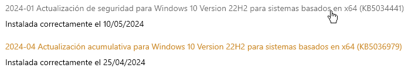

## Testing your Recovery Environment

After performing these steps, your Recovery Environment (RE) will still work. However, if you want to check it out, do the following:

1. Go to the shutdown options in the Start menu, hold down <kbd>Shift</kbd>, and click Restart
2. Go to Troubleshooting -> Advanced Options -> Command Prompt
3. (Optional) Provide your user and password if necessary
4. Verify that everything still works fine
5. Once complete, close the Command Prompt and click Continue

## Summary

To summarize everything that has been done:

- We have looked at how the update is installed,
- We have prepared the recovery image for servicing,
- We have added the updates to the Windows RE image and the active installation, and
- We have tested the resulting Windows RE image with success

## Reporting issues

If you experience any problems with this guide, please create a new issue. All contributions are welcome.