# How to properly do a Windows system reset

According to Microsoft, if your system does not work properly, you can try to reset it.

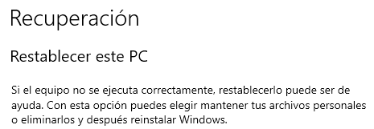

However, should you always do a system reset? In this tutorial we will go through the system reset procedure - whether you should do it, the implications, and a better way of performing the same steps.

## System resets, explained

Microsoft introduced the ability to reset a system from the Settings app in [Windows 8](https://en.wikipedia.org/wiki/Windows_8). Much like resetting a smartphone or a tablet<!-- iPhone or iPad for those Apple fans -->, resetting a PC restores the original Windows image that had been preloaded by either you or the computer manufacturer.

Back in Windows 8, resetting a computer required you to have some form of media containing an operating system (OS) image. This changed with Windows 10 and 11, which are supposed to reset the system without it, by rebuilding themselves using side-by-side (SxS) assemblies from the WinSxS folder:

> IIRC Windows 8.x could only do "resets" if there was an OS image on the PC that it could use to reinstall. 
>
> Same works for 10 and 11 too, and it usually works well, it's just that these new versions are supposed to be able to reset themselves without that OS image, by rebuilding the OS from WinSxS.
>
> -- [feherneoh](https://reddit.com/u/feherneoh) on this [Reddit thread](https://www.reddit.com/r/WindowsHelp/comments/1c7vaht/comment/l0bekyb/)

Now, when initiating a system reset from Settings, you are presented with 2 options: keep your files or wipe your drive:

*Source: Windows Central*

Next, you need to decide on either downloading an OS image or restoring the computer locally:

*Source: Windows Central*

Finally, you are given a recap of this procedure, depending on what you chose at the beginning:

*Source: Windows Central*

> [!NOTE]
> More information can be found [here](https://www.windowscentral.com/how-reset-windows-10-pc-factory-settings)

After it has started, leave your computer on and plugged in, as it will reboot; and you will get to a clean Windows installation eventually.

### The "outcomes"

In a perfect world, the process explained would just work. However, since you are reading this article, you have a hunch that it does not work right. And **you are right**.

Unlike resetting a phone or a tablet, resetting a PC using this method can be hit-or-miss. Oftentimes it is the latter. Because of this, there are several outcomes of this function:

- **Your system resets successfully and you are given a clean Windows desktop**. This has the least odds of happening
- **Your system resets successfully, but some functionality is impaired**. For example, [some Store applications not working after the reset](https://www.reddit.com/r/WindowsHelp/comments/1bx6f3a/comment/kycoai7/?utm_source=share&utm_medium=web3x&utm_name=web3xcss&utm_term=1&utm_content=share_button)
- **You try to reset your system, but it ends up being unable to [boot](https://www.reddit.com/r/WindowsHelp/comments/17lzy91/help_my_pc_is_stuck_in_a_blue_screen_loop_after_a/) or [log you in](https://www.reddit.com/r/WindowsHelp/comments/199er75/laptop_unusable_after_trying_to_erase_data/)**
- **You try to reset your system, but it ends up in a [restart loop](https://www.reddit.com/r/windows/comments/m386md/my_pc_is_stuck_in_this_loop_during_a_factory/)**
- **You try to reset your system, but it [throws an error during the process](https://www.reddit.com/r/WindowsHelp/comments/1c43z9t/help_this_keeps_happening_and_then_it_resets/)**
- **You try to reset your system, but it fails before starting**, thanks to an error from the Settings application
- **It takes forever to reset your computer**. This can happen if you chose to wipe your drive. Try giving it some more time

**Why does that happen?** It might be because people initiate system resets when their Windows installation is corrupted and, since Windows 10 and 11 use the side-by-side assemblies, this goes wrong:

> Now this is what usually fails. 90% of the time someone tries resetting the PC it's because Windows broke. Now it's not so surprising when you can't use the files of an already broken OS to install a working one.
> 
> -- [feherneoh](https://reddit.com/u/feherneoh) on this [Reddit thread](https://www.reddit.com/r/WindowsHelp/comments/1c7vaht/comment/l0bekyb/)

This is **not** the definitive answer though, and Setup logs may show us more information and the exact cause of the error, since resetting a computer uses the same Windows Setup technology used by the Windows installer.

### Resetting a Windows computer is NOT a way to prepare to sell a computer

If you are planning to sell a computer, you should not use the reset procedure, since the next owner, if he/she has knowledge, may be able to recover your files:

> Remaining 10% is for preparing a PC to be sold, which is a perfect recipe for making the buyer be able recover your "deleted" files.
> 
> -- [feherneoh](https://reddit.com/u/feherneoh) on this [Reddit thread](https://www.reddit.com/r/WindowsHelp/comments/1c7vaht/comment/l0bekyb/)

To solve this issue, consider running [DBAN](https://sourceforge.net/projects/dban/), or any other data removal software, and continuing with this guide.

### Resetting a Windows computer may not help you get rid of malware

This is the case when it comes to infections with persistent malware, like rootkits or some trojans, as they persist after a system reset.

If the malware you have been infected with does not embed to firmware, you can try removing it with this guide.

> [!IMPORTANT]
> This is **not** guaranteed to work

Otherwise, try updating your BIOS/UEFI firmware and checking if Secure Boot is enabled.

## The proper way to reset a computer

Now that we have considered these things, here comes a proper and more effective way to reset a computer. This involves **creating installation media** and installing Windows from there

### Requirements

- **A computer with no malware**. Some malware may be transferred to your installation media, meaning that you may install an already infected copy of Windows
- **An Internet connection**. This is required to download the ISO file of Windows
- **A USB flash drive**, preferrably 8 GB or larger in size, in which to store the Windows ISO file

### Downloading the Windows ISO

You can download the ISO file of Windows by using the **Media Creation Tool**. Go to either [here](https://go.microsoft.com/fwlink/?linkid=2156295) or [here](https://go.microsoft.com/fwlink/?LinkId=2265055) to download the MCT program for the appropriate Windows version. The former link downloads the Windows 11 version, while the latter downloads the Windows 10 version. Then go through each screen:

1. Accept the license terms

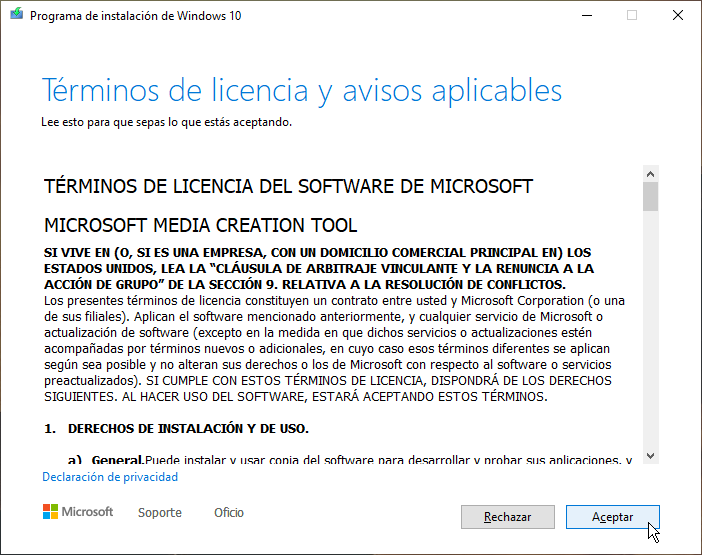

2. Choose the second option (Create installation media)

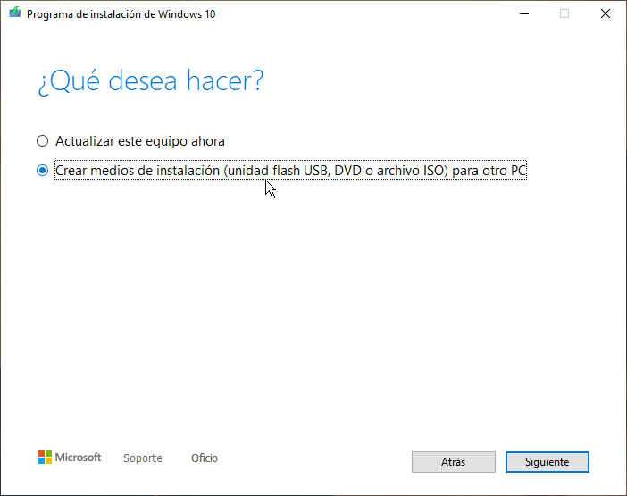

3. Configure your installation media to your liking

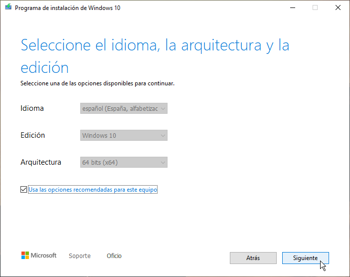

4. Choose either "USB flash drive" or "ISO file"

    - Choose ISO file if you want to use [Rufus](https://rufus.ie)

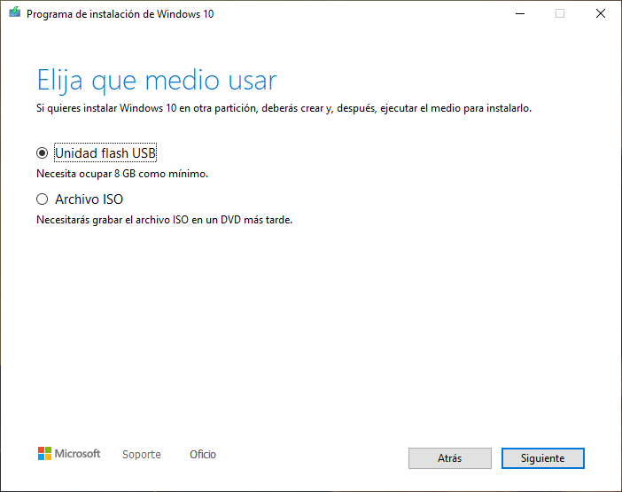

5. Wait for the installation media to be created

### Installing Windows

Once you have installation media created, boot to it. After it finishes starting up, do the following:

1. Configure language and international settings and click Next:

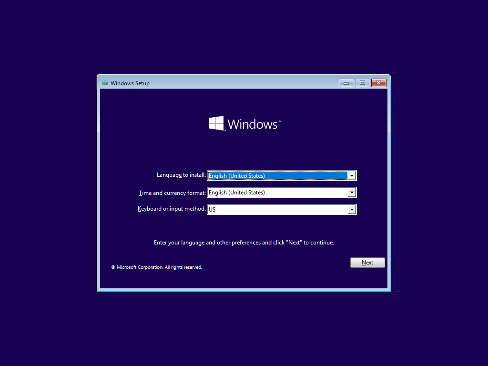

2. Click the "Install now" link and wait for Setup to start:

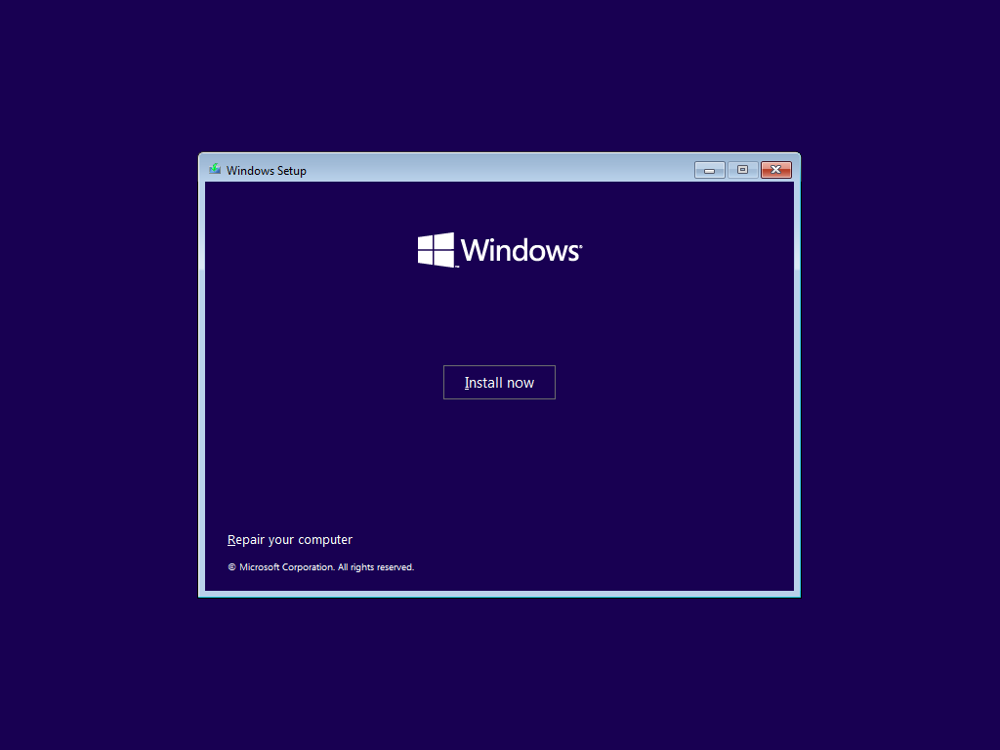

3. Type your product key and click Next. If you don't have one, click "I don't have a product key"

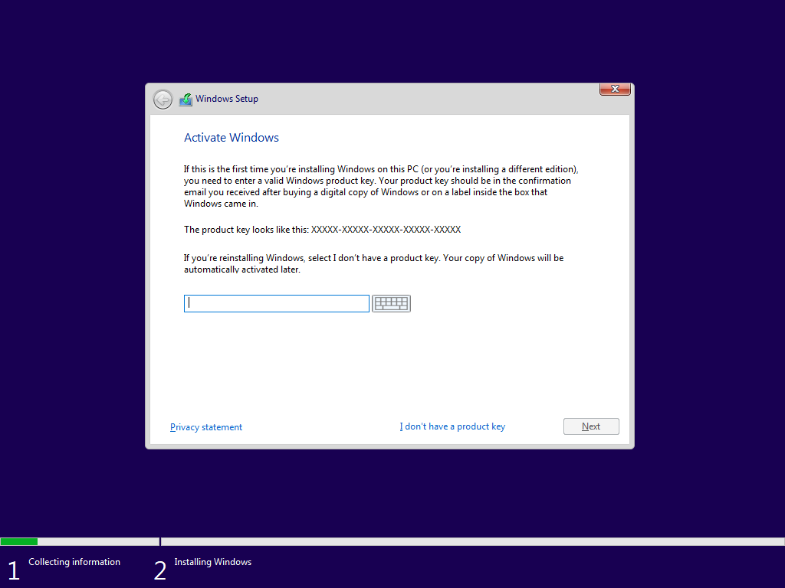

4. Choose the Windows edition you were previously using if you are given an edition list. Then click Next:

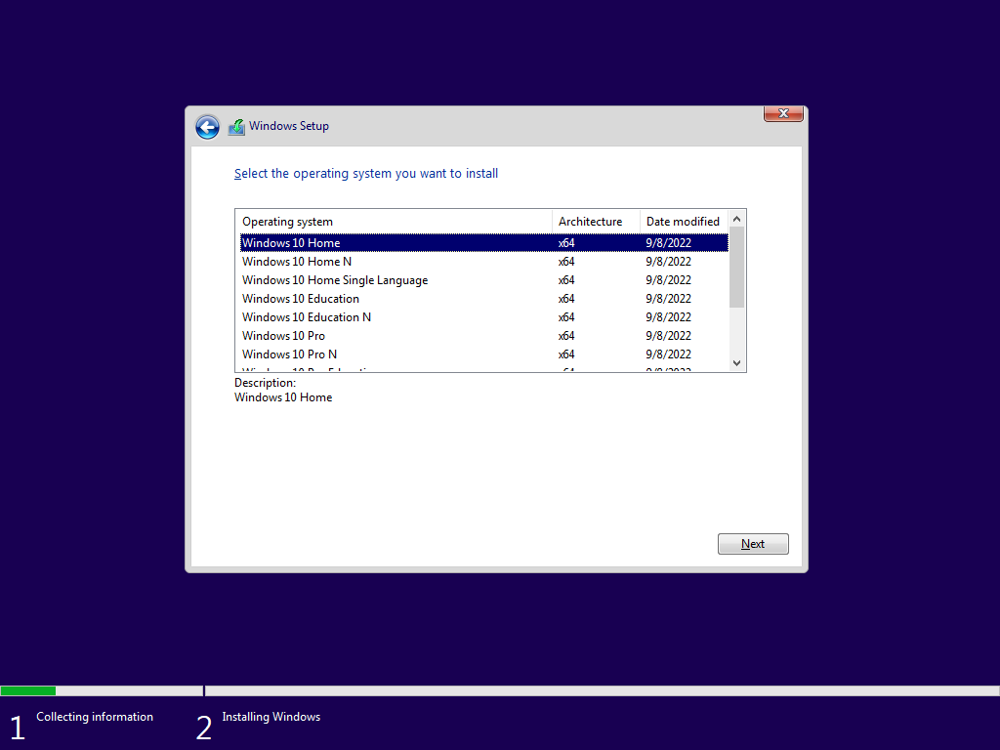

5. Accept the License terms once again:

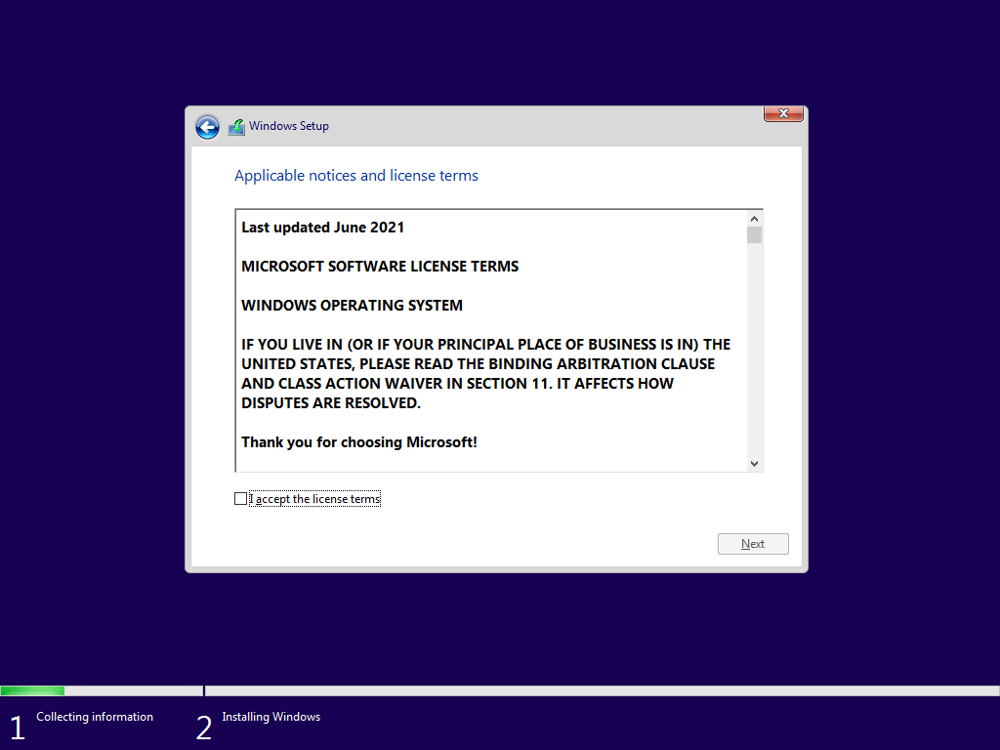

6. Choose "Custom: Install Windows only (advanced)":

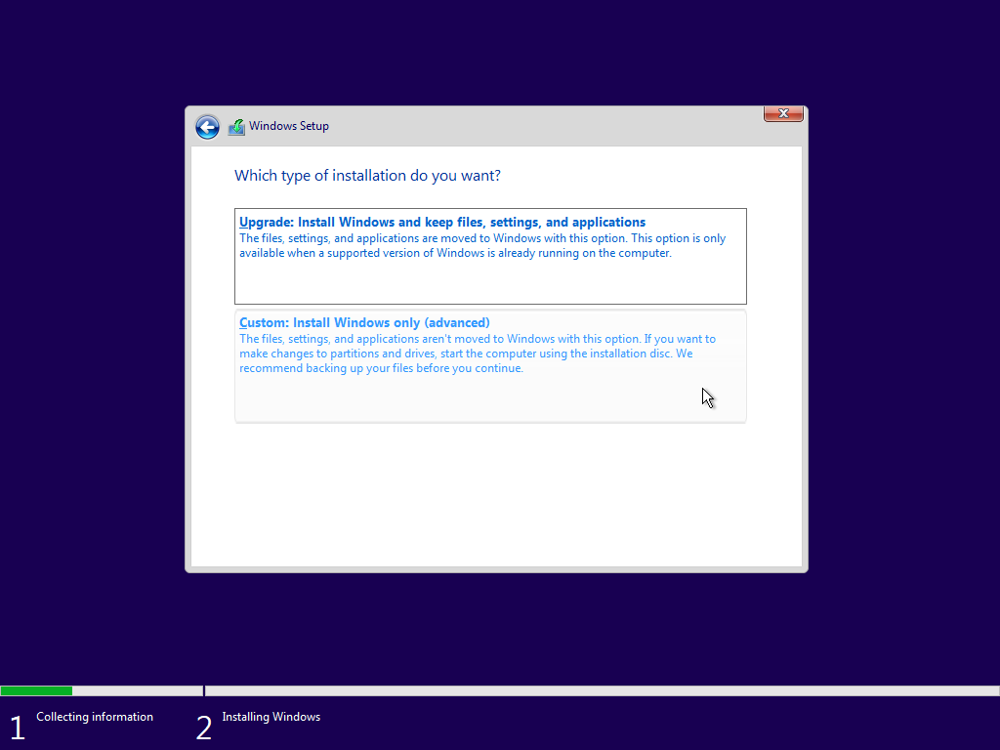

7. Choose the disk you want to install Windows to:

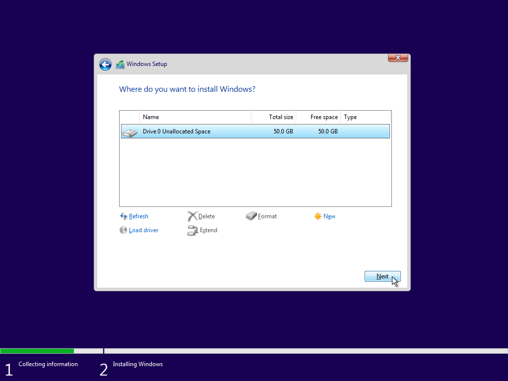

This is the equivalent of the options we saw at the beginning of this guide:

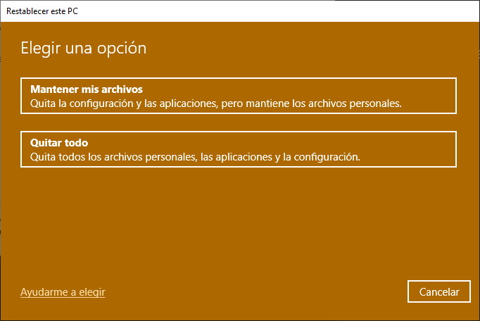

- To **keep your files**, simply select the drive and click Next. You will see the following dialog:

    

    Continuing will move all files of the old Windows installation to a `Windows.old` folder. After installation, you can recover these files

- To **wipe your drive**, select the partition and click Delete. Click Yes on the warning that will then appear. Do this for all partitions until you only have **Unallocated Space**

8. Wait for Windows to be installed

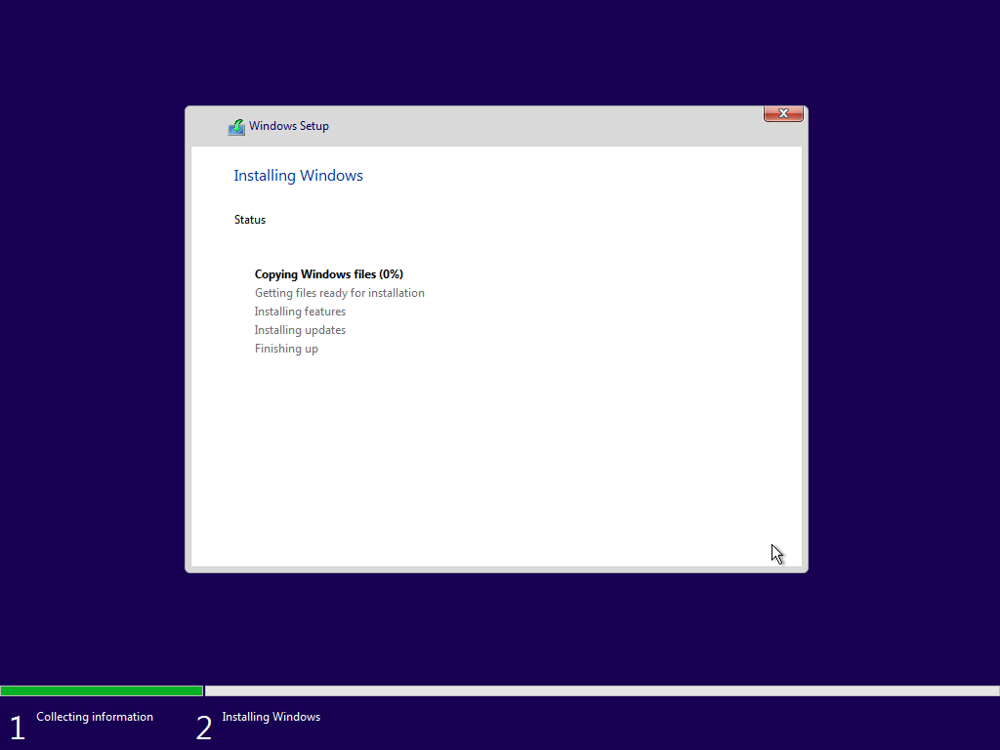

> [!NOTE]
> If you cannot see your drive, boot to live Linux media to get the model of your boot drive and download compatible mass storage drivers. Then, back at Windows Setup, click "Load driver" -> Browse..., choose the path of the drivers, select them, and click Next

Congratulations! You now have a clean installation of Windows.

### Drawbacks

There are some drawbacks in this method:

- OEM customizations, applications and tools will not be available
- The target Windows installation may not have the drivers for your computer installed, so you may need to use Windows Update or other means
- The target Windows installation may not be activated

## Summary

To summarize everything that has been done:

- We have looked at how system resets work in Windows and their issues, and
- We have looked at how to manually reset a computer by installing Windows,

## Thanks

Special thanks to [feherneoh](https://reddit.com/u/feherneoh) on Reddit for giving some information regarding system resets.

## Reporting issues

If you experience any problems with this guide, please create a new issue. All contributions are welcome.